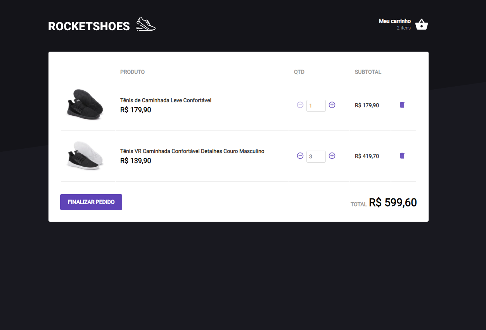

<h1 align="center">
 Rocketshoes
</h1>

  <a href="#-tecnologias">Tecnologias</a>&nbsp;&nbsp;&nbsp;|&nbsp;&nbsp;&nbsp;
  <a href="#-projeto">Projeto</a>&nbsp;&nbsp;&nbsp;|&nbsp;&nbsp;&nbsp;
  <a href="#-como-executar">Como executar</a>&nbsp;&nbsp;&nbsp;|&nbsp;&nbsp;&nbsp;
  <a href="#-Licença">Licença</a>&nbsp;&nbsp;&nbsp;&nbsp;&nbsp;&nbsp;

 

  Página principal  
  
  

  Carrinho de compras  
  

## ✨ Tecnologias

Esse projeto foi desenvolvido com as seguintes tecnologias:

- [React](https://reactjs.org)
- [TypeScript](https://www.typescriptlang.org/) 
- [Axios](https://github.com/axios/axios) 
- [Sass](https://sass-lang.com/)
- [Json Server](https://github.com/typicode/json-server)
- [React Toastify](https://github.com/fkhadra/react-toastify#readme)

## 💻 Projeto

Rocketshoes é um projeto realizado durante o bootcamp Ignite da Rocketseat, sua funcionalidade é simular um carrinho de compras, podendo adicionar determinado na página principal item até seu estoque esgotar,
o mesmo vale para finalização da compra, caso o usuário tente inserir itens que estão fora de estoque uma mensagem de erro é exibida. Pude aprimorar a utilização dos hooks, imutabilidade e componentização.

## 🚀 Como executar

- Clone o repositório colando`git clone https://github.com/lxcvz/rocketshoes_lx.git` em seu terminal.
- Instale as dependências com `yarn`
- Inicie o servidor com `yarn start` 
- inicie o json server com `yarn server`

Agora você pode acessar [`localhost:3000`](http://localhost:3000/) do seu navegador.

## 📝 Licença 

Esse projeto está sob a licença MIT. Veja o arquivo [LICENSE](/LICENSE) para mais detalhes. 

#
